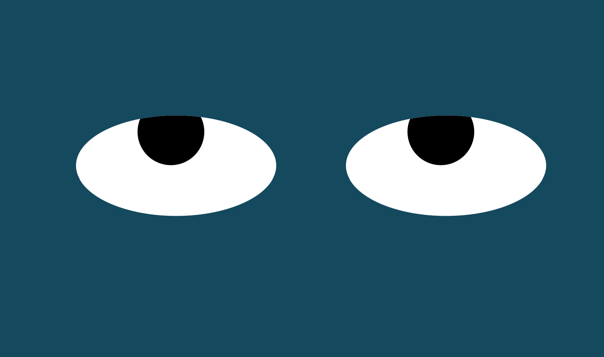

# Moving Eyes
This Moving Eyes exercise contains code for setting up two eyes that follow a mouse cursor as it moves around the screen. The eyes move in tandem with one another.

## How To Run
In order to run this code after cloning the repo, open index.html in a browser. From there, move your mouse cursor within the browser screen and the eyes will follow the movement.

## Roadmap of Future Improvements
In the future, the hope is to improve on this project with the addition of other interactive components to help form a face around the eyes. For example, a mouth that smiles and frowns depending on where the mouse is on the screen. Another potential improvement includes adding more responses to the eyes themselves, namely having them open and close when the mouse clicks on them. 

## License
MIT License

Copyright (c) 2022 Mariah Villanueva

Permission is hereby granted, free of charge, to any person obtaining a copy
of this software and associated documentation files (the "Software"), to deal
in the Software without restriction, including without limitation the rights
to use, copy, modify, merge, publish, distribute, sublicense, and/or sell
copies of the Software, and to permit persons to whom the Software is
furnished to do so, subject to the following conditions:

The above copyright notice and this permission notice shall be included in all
copies or substantial portions of the Software.

THE SOFTWARE IS PROVIDED "AS IS", WITHOUT WARRANTY OF ANY KIND, EXPRESS OR
IMPLIED, INCLUDING BUT NOT LIMITED TO THE WARRANTIES OF MERCHANTABILITY,
FITNESS FOR A PARTICULAR PURPOSE AND NONINFRINGEMENT. IN NO EVENT SHALL THE
AUTHORS OR COPYRIGHT HOLDERS BE LIABLE FOR ANY CLAIM, DAMAGES OR OTHER
LIABILITY, WHETHER IN AN ACTION OF CONTRACT, TORT OR OTHERWISE, ARISING FROM,
OUT OF OR IN CONNECTION WITH THE SOFTWARE OR THE USE OR OTHER DEALINGS IN THE
SOFTWARE.
